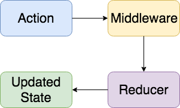
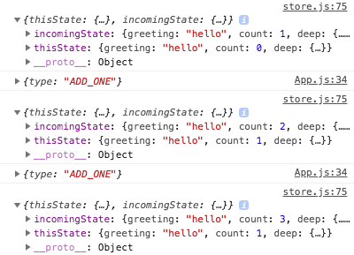

# [译]开发类 redux 库来理解状态管理

> 原文[地址](https://hackernoon.com/building-a-redux-like-state-manager-for-react-cd75cc2853b3)

> 对于想要跳过文章直接看结果的人，我已经把我写的内容制作成了一个库：[use-simple-state](https://github.com/Jahans3/use-simple-state)，无任何依赖（除了依赖 react ），只有3kb，相当轻量。

* 近几年，应我们的 app 增长的需要，web 应用数量增长迅速，随之而来的还有复杂性。为了使增加的复杂性易于处理，应用某些新增的技巧和模式使得开发者可以更简单的处理以及帮助我们建立更加健壮的应用。
* 其中一个复杂性增长的主要领域是管理我们应用的状态，因此为了避免这种复杂性，开发者使用了包含更新和获取 app 状态的库。最著名的例子是 redux，它是 flux 模式的一种应用。
* 一旦开发者开始学习使用像 redux 的库，他们可能不太了解库的内部运行机制，因为一开始这并不明显，即使很容易了解到这是更新一个全局可用的对象这样的一个概念。
* 在这篇文章中，我们将会从零开始为 react 应用建立一个我们自己的状态管理解决方案。我们的解决方案最初只有几行代码，逐渐增加更高级的特性，最终将类似于 redux。

## 基本概念

* 任何状态管理工具只需要两件东西：对整个应用都可用的全局状态，和读取以及更新它的能力。只有这些，真的。
* 这里展示一个状态管理的简单例子：
```javascript
const state = {};

export const getState = () => state;

export const setState = nextState => {
  state = nextState;
};
```
* 上面的例子已经尽可能的简单，但它仍然包含了所有的要素：
> 一个全局可用的用于展现我们应用状态的值：state；
>
> 读取状态的能力：getState；
>
> 更新状态的能力：setState。

* 上面的例子对于我们真实应用来说太过简单，因此接下来我们将要构建一个能让 react 可用的解决方案。首先我们来重构我们的例子，以让它在 react 中可用。

## react 状态管理

* 为了制作一个我们之前解决方案的 react 版本，我们需要应用两个 react 功能。第一个功能是普通经典类组件，也就是众所周知的有状态组件。
* 第二个功能是 `context` API，它可以让数据在整个 react 应用可用。`context` 有两部分：provider (生产者) 和 consumer (消费者)，provider 就像它的名字所说的那样，给应用提供 `context` (data 数据)，消费者意指当我们读取 `context` 时，我们就是消费者。
* 可以这样理解 `context`：如果说 `props` 是显式的传送数据，那么 `context` 就是隐式的传送数据。

## 建造我们自己的状态管理器

* 现在我们知道了需要哪些工具，现在只要把它们合在一起就可以了。我们准备创建一个上下文环境来存放全局状态，然后把它的 provider 包裹在一个有状态组件中，然后用 provider 来管理状态。

* 首先，我们使用 `React.createContext` 来创建上下文，它可以给我们提供 provider 和 consumer。

* ```javascript
  import { createContext } from 'react';
  
  const { Provider, Consumer } = createContext();
  ```

* 接下来我们需要用有状态组件包裹我们的 provider，利用它进行应用状态的管理。我们也应该把 consumer 导出为一个更加准确的名称。

* ```javascript
  import React, { Component, createContext } from 'react';
  
  const { Provider, Consumer } = createContext();
  
  export const StateConsumer = Consumer;
  
  export class StateProvider extends Component {
    static defaultProps = {
      state: {}
    };
  
    state = this.props.state;
  
    render () {
      return (
        <Provider value={this.state}>
          {this.props.children}
        </Provider>
      );
    }
  }
  ```

* 在上面的例子中，`StateProvider` 是接收一个 `state` 来作为初始状态的组件，并且使组件树中当前组件下面的任何组件都可以访问到这个属性。如果没有提供 `state`，默认会有一个空对象代替。

* 用我们的 `StateProvider` 包裹住根组件：

* ```javascript
  import { StateProvider } from './stateContext';
  import MyApp from './MyApp';
  
  const initialState = {
    count: 0
  };
  
  export default function Root () {
    return (
      <StateProvider state={initialState}>
        <MyApp />
      </StateProvider>
    );
  }
  ```

* 在我们完成上述代码之后，就可以作为一个消费者从 `MyApp` 的任何地方获得应用的状态。在这里我们会初始化我们的状态为一个有一个 `count` 属性的对象，所以无论什么时候我们想要立即获取应用的状态，我们就可以从这里获得。

* 消费者使用  [render props](https://reactjs.org/docs/render-props.html) 来传递上下文数据，我们可以通过下面的一个函数作为 `StateConsumer` 的子组件的例子来查看。`state` 参数传递给函数用以展现我们应用的当前状态，作为我们的初始状态，`state.count` 为 0.

* ```javascript
  import { StateConsumer } from './stateContext';
  
  export default function SomeCount () {
    return (
      <StateConsumer>
        {state => (
          <p>
            Count: {state.count}
          </p>
        )}
      </StateConsumer>
    );
  }
  ```

* 关于 `StateConsumer` 我们需要知道的很重要一点是在上下文中它会自动订阅状态的改变，因此当我们的状态改变后会重新渲染以显示更新。这就是消费者的默认行为，我们暂时还没做能够用到这个特性的功能。

## 更新状态

* 目前为止我们已经可以读取应用的状态，以及在状态改变时自动更新。现在我们需要一种更新状态的方法，为了做到这一点我们仅仅只需要在 `StateProvider` 里面更新状态。

* 你之前可能已经注意到了，我们给 `StateProvider` 传递了一个 `state` 属性，也就是之后会传递给组件的 `state` 属性。我们将使用 react 内置的 `this.setState` 来更新：

* ```javascript
  export class StateProvider extends Component {
    static defaultProps = {
      state: {}
    };
  
    state = this.props.state;
  
    render () {
      return (
        <Provider value={{ state: this.state, setState: this.setState.bind(this) }}>
          {this.props.children}
        </Provider>
      );
    }
  ```

* 继续保持简单的风格，我们只给上下文传递 `this.setState`，这意味着我们需要稍微改变我们的上下文传值，不只是传递 `this.state`，我们现在同时传递 `state` 和 `setState`。

* 当我们用 `StateConsumer` 时可以用[解构赋值](https://developer.mozilla.org/en-US/docs/Web/JavaScript/Reference/Operators/Destructuring_assignment)获取 `state` 和 `setState`，然后我们就可以读写我们的状态对象了：

* ```javascript
  export default function SomeCount () {
    return (
      <StateConsumer>
        {({ state, setState }) => (
          <>
            <p>
              Count: {state.count}
            </p>
            <button onClick={() => setState({ count: state.count + 1 })}>
              + 1
            </button>
            <button onClick={() => setState({ count: state.count - 1 })}>
              - 1
            </button>
          </>
        )}
      </StateConsumer>
    );
  }
  ```

* 有一点要注意的是由于我们传递了 react 内置的 `this.setState` 作为我们的 `setState` 方法，新增的属性将会和已有的状态合并。这意味着如果我们有 `count` 以外的第二个属性，它也会被自动保存。

* 现在我们的作品已经可以用在真实项目中了(尽管还不是很有效率)。对 react 开发者来说应该会觉得 API 很熟悉，由于使用了内置的工具因此我们没有引用任何新的依赖项。假如之前觉得状态管理有点神奇，希望现在我们多少能够了解它内部的结构。

## 华丽的点缀

* 熟悉 redux 的人可能会注意到我们的解决方案缺少一些特性：

  >* 没有内置的处理副作用的方法，你需要通过 [redux 中间件](https://redux.js.org/advanced/middleware)来做这件事
  >* 我们的 `setState` 依赖 react 默认的 `this.setState` 来处理我们的状态更新逻辑，当使用内联方式更新复杂状态时将可能引发混乱，同时也没有内置的方法来复用状态更新逻辑，也就是 [redux reducer](https://redux.js.org/basics/reducers) 提供的功能。
  >* 也没有办法处理异步的操作，通常由 [redux thunk](https://github.com/reduxjs/redux-thunk) 或者 [redux saga](https://github.com/redux-saga/redux-saga)等库来提供解决办法。
  >* 最关键的是，我们没办法让消费者只订阅部分状态，这意味着只要状态的任何部分更新都会让每个消费者更新。

* 为了解决这些问题，我们模仿 redux 来应用我们自己的 **actions**，**reducers**，和 **middleware**。我们也会为异步 actions 增加内在支持。之后我们将会让消费者只监听状态内的子状态的改变。最后我们来看看如何重构我们的代码以使用新的 [**hooks api**](https://reactjs.org/docs/hooks-intro.html)。

## redux 简介

> 免责声明：接下来的内容只是为了让你更容易理解文章，我强烈推荐你阅读 [redux 官方](https://redux.js.org/introduction/motivation)完整的介绍。
>
> 如果你已经非常了解 redux，那你可以跳过这部分。

* 下面是一个 redux 应用的数据流简化流程图：



* 如你所见，这就是单向数据流，从我们的 reducers 接收到状态改变之后，触发 actions，数据不会回传，也不会在应用的不同部分来回流动。

* 说的更详细一点：

* 首先，我们触发一个描述改变状态的 action，例如 `dispatch({ type: INCREMENT_BY_ONE })` 来加1，同我们之前不同，之前我们是通过 `setState({ count: count + 1 })`来直接改变状态。

* action 随后进入我们的中间件，redux 中间件是可选的，用于处理 action 副作用，并将结果返回给 action，例如，假如在 action 到达 reducer 之前触发一个 `SIGN_OUT` 的 action 用于从本地存储里删除所有用户数据。如果你熟悉的话，这有些类似于 [express](https://expressjs.com/) 中间件的概念。

* 最后，我们的 action 到达了接收它的 reducer，伴随而来的还有数据，然后利用它和已有的状态合并生成一个新的状态。让我们触发一个叫做 `ADD` 的 action，同时把我们想发送过去增加到状态的值也发送过去(叫做 payload )。我们的 reducer 会查找叫做 `ADD` 的 action，当它发现后就会将 payload 里面的值和我们现有的状态里的值加到一起并返回新的状态。

* reducer 的函数如下所示：

* ```javascript
  (state, action) => nextState
  ```

* reducer 应当只是处理 state 和 action ，虽然简单却很强大。关键是要知道 reducer 应当永远是纯函数，这样它们的结果就永远是确定的。

## actions + dispatch

* 现在我们已经过了几个 redux app 的关键部分，我们需要修改 app 来模仿一些类似的行为。首先，我们需要一些 actions 和触发它们的方法。

* 我们的 action 会使用 action 创建器来创建，它们其实就是能生成 action 的简单函数，action 创建器使得测试，复用，传递 payload 数据更加简单，我们也会创建一些 action type，其实就是字符串常量，为了让他们可以被 reducer 复用，因此我们把它存储到变量里：

* ```javascript
  // Action types
  const ADD_ONE = 'ADD_ONE';
  const ADD_N = 'ADD_N';
  
  // Actions
  export const addOne = () => ({ type: ADD_ONE });
  export const addN = amount => ({ type: ADD_N, payload: amount });
  ```

* 现在我们来做一个 `dispatch` 的占位符函数，我们的占位符只是一个空函数，将会被用于替换上下文中的 `setState` 函数，我们一会再回到这儿，因为我们还没做接收 action 的 reducer 呢。

* ```javascript
  export class Provider extends React.PureComponent {
    static defaultProps = {
      state: {}
    };
  
    state = this.props.state;
  
    _dispatch = action => {};
  
    render () {
      return (
        <StateContext.Provider value={{ state: this.state, dispatch: this._dispatch }}>
          {this.props.children}
        </StateContext.Provider>
      );
    }
  }
  ```

## reducers

* 现在我们已经有了一些 action，只需要一些 reducer 来接收就好了。回到之前的 reducer 函数标记，它只是一个关于 action 和 state 的纯函数：

* ```javascript
  (state, action) => nextState
  ```

* 知道了这个，我们只需要传递组件的状态，然后在 reducer 里触发 action。对 reducer 来说，我们只想要一个对应上面标记的函数数组。我们之所以使用一个数组是因为可以使用数组的 `Array.reduce` 方法来迭代数组，最终生成我们的新状态：

* ```javascript
  export class Provider extends React.PureComponent {
    static defaultProps = {
      state: {},
      reducers: []
    };
  
    state = this.props.state;
  
    _dispatch = action => {
      const { reducers } = this.props;
      const nextState = reducers.reduce((state, reducer) => {
        return reducer(state, action) || state;
      }, this.state);
  
      this.setState(nextState);
    };
  
    render () {
      return (
        <StateContext.Provider value={{ state: this.state, dispatch: this._dispatch }}>
          {this.props.children}
        </StateContext.Provider>
      );
    }
  }
  ```

* 如你所见，我们所做的就是使用 reducer 来计算并获得新状态，然后就像之前所做的，我们调用 `this.setState` 来更新 `StateProvider` 组件的状态。

* 现在我们只需要一个实际的 reducer：

* ```javascript
  function countReducer ({ count, ...state }, { type, payload }) {
    switch (type) {
      case ADD_N:
        return { ...state, count: count + payload };
      case ADD_ONE:
        return { ...state, count: count + 1 };
    }
  }
  ```

* 我们的 reducer 只是检查传入的 `action.type`，然后假如匹配到之后将会更新相对应的状态，否则就会在经过 `switch` 判断语句之后返回函数默认的 `undefined`。我们的 reducer 和 redux 的 reducer 的一个重要的区别在当我们不想更新状态时，一般情况下我们会因为未匹配到 action type 而返回一个[falsy](https://developer.mozilla.org/en-US/docs/Glossary/Falsy) 值，而 redux 则会返回未变化的状态。

* 然后把我们的 reducer 传进 `StateProvider`:

* ```javascript
  export default function Root () {
    return (
      <StateProvider state={initialState} reducers={[countReducer]}>
        <MyApp />
      </StateProvider>
    );
  }
  ```

* 现在我们终于可以触发一些 action，然后就会观察到相对应的状态更新：

* ```javascript
  export default function SomeCount () {
    return (
      <StateConsumer>
        {({ state, dispatch }) => (
          <>
            <p>
              Count: {state.count}
            </p>
            <button onClick={() => dispatch(addOne())}>
              + 1
            </button>
            <button onClick={() => dispatch(addN(5))}>
              + 5
            </button>
            <button onClick={() => dispatch(addN(10))}>
              + 10
            </button>
          </>
        )}
      </StateConsumer>
    );
  
  ```
## 中间件

* 现在我们的作品已经跟 redux 比较像了，只需要再增加一个处理副作用的方法就可以。为了达到这个目的，我们需要允许用户传递中间件函数，这样当 action 被触发时就会被调用了。
* 我们也想让中间件函数帮助我们处理状态更新，因此假如返回的 `null` 就不会被 action 传递给 reducer。redux 的处理稍微不同，在 redux 中间件你需要手动传递 action 到下一个紧邻的中间件，假如没有使用 redux 的 `next` 函数来传递，action 将不会到达 reducer，而且状态也不会更新。

* 现在让我们写一个简单的中间件，我们想通过它来寻找 `ADD_N` action，如果它找到了那就应当把 `payload` 和当前状态里面的 `count` 加和并输出，但是阻止实际状态的更新。
```javascript
function countMiddleware ({ type, payload }, { count }) {
  if (type === ADD_N) {
    console.log(`${payload} + ${count} = ${payload + count}`);
    return null;
  }
}
```
* 跟我们的 reducer 类似，我们会将中间件用数组传进我们的 `StateProvider`。

* ```javascript
  export default function Root () {
    return (
      <StateProvider
        state={initialState}
        reducers={[countReducer]}
        middleware={[countMiddleware]}
      >
        <MyApp />
      </StateProvider>
    );
  }
  ```

* 最终我们会调用所有所有中间件，然后根据返回的结果决定是否应当阻止更新。由于我们传进了一个数组，然而我们需要的是一个单个值，因此我们准备使用 `Array.reduce` 来获得我们的值。跟 reducer 类似，我们也会迭代数组依次调用每个函数，然后将结果赋值给一个变量 `continueUpdate`。

* 由于中间件被认为是一个[高级特性](https://redux.js.org/advanced)，因此我们不想它变成强制性的，因此如果没有在`StateProvider` 里面找到 `middleware` 属性，我们会将 `continueUpdate` 置为默认的 `undefined`。我们也会增加一个 `middleware` 数组来作默认属性，这样的话 `middleware.reduce` 就不会因为没传东西而抛出错误。

* ```javascript
  export class StateProvider extends React.PureComponent {
    static defaultProps = {
      state: {},
      reducers: [],
      middleware: []
    };
  
    state = this.props.state;
  
    _dispatch = action => {
      const { reducers, middleware } = this.props;
      const continueUpdate = middleware.reduce((result, middleware) => {
        return result !== null ? middleware(action, this.state) : result;
      }, undefined);
  
      if (continueUpdate !== null) {
        const nextState = reducers.reduce((state, reducer) => {
          return reducer(state, action) || state;
        }, this.state);
  
        this.setState(nextState);
      }
    };
  
    render () {
      return (
        <StateContext.Provider value={{ state: this.state, dispatch: this._dispatch }}>
          {this.props.children}
        </StateContext.Provider>
      );
    }
  }
  ```

* 如你所见在第13行，我们会查看中间件函数的返回值。如果返回 `null` 我们就会跳过剩下的中间件函数，`continueUpdate` 将为 `null`，意味着我们会中断更新。

## 异步 action

* 因为我们想让我们的状态管理器对真实生产环境有用，所以我们需要增加对异步 action 的支持，这意味着我们将可以处理像网络请求类似案例的通用任务。我们借鉴下 [Redux Thunk](https://github.com/reduxjs/redux-thunk) ，因为它的 API 很简单，直观而且有效。

* 我们所要做的就是检查是否有为被调用的函数被传递到 dispatch，如果找到的话我们就会在传递 `dispatch` 和 `state` 时调用函数，这样就可以给用户所写的异步 action 执行的机会。拿这个授权 action 作为例子来看下：

* ```javascript
  const logIn = (email, password) => async dispatch => {
    dispatch({ type: 'LOG_IN_REQUEST' });
  
    try {
      const user = api.authenticateUser(email, password);
      dispatch({ type: 'LOG_IN_SUCCESS', payload: user });
    catch (error) {
      dispatch({ type: 'LOG_IN_ERROR', payload: error });
    }
  };
  ```

* 在上面的例子中我们写了一个叫做 `logIn` 的 action 创建器，不是返回一个对象，它返回一个接收 `dispatch` 的函数，这可以让用户在一个异步 API 请求的前面和后面触发异步 action，根据 API 不同的返回结果触发不同的 action，这里我们在发生错误时发送一个错误 action。

* 做到这一点只需要在 `StateProvider` 里的 `_dispatch` 方法里检查 `action` 的类型是不是 `function`:

* ```javascript
  export class StateProvider extends React.PureComponent {
    static defaultProps = {
      state: {},
      reducers: [],
      middleware: []
    };
  
    state = this.props.state;
  
    _dispatch = action => {
      if (typeof action === 'function') {
        return action(this._dispatch, this.state);
      }
      
      const { reducers, middleware } = this.props;
      const continueUpdate = middleware.reduce((result, middleware) => {
        return result !== null ? middleware(action, this.state) : result;
      }, undefined);
  
      if (continueUpdate !== null) {
        const nextState = reducers.reduce((state, reducer) => {
          return reducer(state, action) || state;
        }, this.state);
  
        this.setState(nextState);
      }
    };
  
    render () {
      return (
        <StateContext.Provider value={{ state: this.state, dispatch: this._dispatch }}>
          {this.props.children}
        </StateContext.Provider>
      );
    }
  }
  ```

* 这里需要注意两点：我们调用 `action` 为函数，传入 `this.state`，这样用户可以访问异步 action 中已有的状态，我们也会返回函数调用的结果，允许开发者从他们的异步 action 中获得一个返回值从而开启更多的可能性，例如从 `dispatch` 触发的 promise 链。

## 避免不必要的重新渲染

* Redux  的一个经常被忽视的必要特性是它能在必须时才会对组件重新渲染（或者更准确的说是 [React-Redux](https://github.com/reduxjs/react-redux)  — react 跟 redux 的绑定）。为了做到这一点，它使用了 `connect` [高阶组件](https://reactjs.org/docs/higher-order-components.html)，它提供了一个映射函数 — `mapStateToProps` — 仅仅只在关联的 `mapStateToProps` 的输出改变时（只映射从现在开始的状态）才会触发组件的重新渲染。如果不这样的话，那么每次状态更新都会让组件使用 connect 来订阅存储改变然后重新渲染。

* 想想我们需要做的，我们需要一种方法来存储 `mapState` 前面的输出，这样我们就可以比较两者看看有没有差异来决定我们是否需要继续向前和重新渲染我们的组件。为了做到这一点我们需要使用一种叫做[记忆化](https://en.wikipedia.org/wiki/Memoization)的进程，跟我们这行的许多事情一样，对于一个想到简单的进程来说，这是一个重要的词，尤其是我们可以使用 `React.Component` 来存储我们状态的子状态，然后仅在我们检测到 `mapState` 的输出改变之后再更新。

* 接下来我们需要一种能够跳过不必要的组件更新的方法。react 提供了一个生命周期方法 `shouldComponentUpdate` 可以让我们达到目的。它将接收到的 props 和 state 当做参数来让我们同现有的 props 和 state 进行比较，如果我们返回 `true` 那么更新继续，如果返回 `false` 那么 react 将会跳过渲染。

* ```javascript
  class ConnectState extends React.Component {
    state = this.props.mapState(this.props.state);
  
    static getDerivedStateFromProps (nextProps, nextState) {}
  
    shouldComponentUpdate (nextProps) {
      if (!Object.keys(this.state).length) {
        this.setState(this.props.mapDispatch(this.props.state));
        return true;
      }
  
      console.log({
        s: this.state,
        nextState: nextProps.mapState(nextProps.state),
        state: this.props.mapState(this.state)
      });
      
      return false;
    }
  
    render () {
      return this.props.children({ state: this.props.state, dispatch: this.props.dispatch });
    }
  }
  
  export function StateConsumer ({ mapState, mapDispatch, children }) {
    return (
      <StateContext.Consumer>
        {({ state, dispatch }) => (
          <ConnectState state={state} dispatch={dispatch} mapState={mapState} mapDispatch={mapDispatch}>
            {children}
          </ConnectState>
        )}
      </StateContext.Consumer>
    );
  }
  ```

* 上面只是对我们接下来要做的事情的概述。它有了所以主要的部分：从我们的 context 接收更新，它使用了 `getDerivedStateFromProps` 和 `shouldComponentUpdate`，它也接收一个 **render props** 来作为子组件，就像默认的消费者一样。我们也会通过使用传递的 `mapState` 函数来初始化我们的消费者初始状态。

* 现在这样的话，`shouldComponentUpdate` 将只会在接收到第一次状态更新之后渲染一次。之后它会记录传进的状态和现有的状态，然后返回 `false`，阻止任何更新。

* 上面的解决方案中在 `shouldComponentUpdate` 内部也调用了 `this.setState`，而我们都知道 `this.setState` 总是会触发重新渲染。由于我们也会从 `shouldComponentUpdate` 里返回 `true`，这会产生一次额外的重新渲染，所以为了解决这个问题，我们将使用生命周期 `getDerivedStateFromProps` 来获取我们的状态，然后我们再使用 `shouldComponentUpdate` 来决定基于我们获取的状态是否继续更新进程。

* 如果我们检查控制台也可以看到全局的状态更新，同时我们的组件阻止任何更新到 `this.state` 对象以至组件跳过更新：

* 

* 现在我们知道了如何阻止不必要的更新，我们还需要一个可以智能的决定我们的消费者何时应当更新的方法。如果我们想要递归循环传进来的 state 对象来查看每个属性来看状态是否有改变，但是这对于帮助我们理解有帮助却对性能不利。我们没办法知道传进来的 state 对象层级有多深或者多复杂，如果条件永远不满足，那么递归函数将会无限期的执行下去，因此我们准备限制我们比较的作用域。

* 跟 redux 类似，我们准备使用一个*浅*比较函数。*浅*在这里意味着我们在比较我们的对象是否相等的属性的层级，意味着我们只会比较一层。因此我们将会检查我们每个新状态的顶层属性是否等于我们现有状态的同名属性，如果同名属性不存在，或者它们的值不同，我们将会继续渲染，否则我们就认为我们的状态时相同的，然后阻止渲染。

* ```javascript
  function shallowCompare (state, nextState) {
    if ((typeof state !== 'object' || state === null || typeof nextState !== 'object' || nextState === null)) return false;
  
    return Object.entries(nextState).reduce((shouldUpdate, [key, value]) => state[key] !== value ? true : shouldUpdate, false);
  }
  ```

* 首先我们从检查是否两个 state 都是对象开始，如果不是那么我们就跳过渲染。在初始检查之后我们把现有的状态转化为一个键值对的数组，并通过将数组减少为单个布尔值来检查每个属性的值与传进来的 state 对象的值。

* 这是困难的部分，现在我们想用我们的 `shallowCompare` 函数，实际上只是调用并检查结果。如果它返回 `true`，我们就返回 `true` 来允许组件重新渲染，否则我们就返回 `false` 来跳过更新(然后我们获得的状态被放弃掉)。我们也想在 `mapDispatch` 存在的时候调用它。

* ```javascript
  class ConnectState extends React.Component {
    state = {};
  
    static getDerivedStateFromProps ({ state, mapState = s => s }) {
      return mapState(state);
    }
  
    shouldComponentUpdate (nextProps, nextState) {
      return shallowCompare(this.state, nextState);
    }
  
    render () {
      return this.props.children({
        state: this.state,
        dispatch: this.props.mapDispatch ? this.props.mapDispatch(this.props.dispatch) : this.props.dispatch
      });
    }
  }
  ```

* 最后我们需要传递一个 `mapState` 函数让我们消费者以只匹配我们的部分状态，这样我们就会将它作为一个属性传给我们的 `StateConsumer`：

* ```javascript
  return (
    <StateConsumer mapState={state => ({ greeting: state.greeting })} mapDispatch={dispatch => dispatch}>
      // ...
  ```

* 现在我们只订阅 `greeting` 里面的改变，因此假如我们更新了组件里的 `count` 将会被我们的全局状态改变所忽略并且避免了一次重新渲染。

## 快速回顾

* 如果你已经做到了这一步，你就已经见到了如何开发一个带有 reducer 和 action 的 类 redux 的状态管理库。我们也覆盖了更高级的特性，例如异步 action，中间件，以及如何让我们只接收我们想要的状态更新，从而避免我们的消费者每次全局状态更新进而引起的重新渲染。
* 尽管 redux 其实做的比我们的解决方案要多得多，希望这个方案有助于澄清一些核心概念，而 redux 通常被认为是一个更加高级的特性，但它的实现其实相对简单。
* 想要对 redux 的内部了解更加彻底，我强烈推荐你阅读它在 [github 的源码](https://github.com/reduxjs/redux/tree/master/src)。
* 我们目前为止的解决方案已经有了真实项目所必须的工具和特性了。我们可以在一个 react 项目中使用它，不需要使用 redux，除非我们想要接入一些真正高级的功能。

## Hooks

* 如果你还没听过它，它正在快速变成 react 的下一个大特性。这里有一段来自官方描述的简单解释：

  >Hooks 是一个让你不必写 class 就可以使用 state 和 react 其他特性的新功能。

* hooks 提供给我们高阶组件的所有能力，以及更加清晰和直观的 API 来渲染属性。

* 我们来看一个使用基本的 `useState` 钩子的例子来看看它们是如何工作的：

  ```javascript
  import React, { useState } from 'react';
  
  function Counter () {
    const [count, setCount] = useState(0);
    return (
      <>
        <span>
          Count: {count}
        </span>
        <button onClick={() => setCount(count + 1)}>
          Increment
        </button>
      </>
    );
  }
  ```

* 在上面的例子中，我们通过给 `useState` 传递一个 0 来初始化新状态，它会返回我们的状态：`count`，以及一个更新函数 `setCount`。如果你以前没见过的话，可能会奇怪 `useState` 是如何不在每次渲染时初始化，这是因为 react 在内部处理了，因此我们无需担心这一点。

* 让我们暂时先忘掉中间件和异步 action，用 `useReducer` 钩子来重新应用我们的 provider，就像我们正在做的一样，除了将 action 触发到一个获得新状态的 reducer，它就像 `useState` 一样工作。

* 知道了这个，我们只需要将 reducer 的逻辑从老的 `StateProvider` 拷贝到新的函数组件 `StateProvider`里就可以了：

  ```javascript
  export function StateProvider ({ state: initialState, reducers, middleware, children }) {
    const [state, dispatch] = useReducer((state, action) => {
      return reducers.reduce((state, reducer) => reducer(state, action) || state, state);
    }, initialState);
  
    return (
      <StateContext.Provider value={{ state, dispatch }}>
        {children}
      </StateContext.Provider>
    );
  }
  ```

* 可以如此的简单，但是当我们想要保持简单时，我们仍然没有完全掌握 hooks 的所有能力。我们也可以使用 hooks 来把我们的 `StateConsumer` 换为我们自己的钩子，我们可以通过包裹 `useContext` 钩子来做到：

  ```javascript
  const StateContent = createContext();
  
  export function useStore () {
    const { state, dispatch } = useContext(StateContext);
    return [state, dispatch];
  }
  ```

* 尽管之前当我们创建我们的上下文时使用了解构的 `Provider` 和 `Consumer`，但是这次我们会将它存到我们传递到 `useContext` 单个变量从而让我们可不用 `Consumer` 就可以接入上下文。我们也将它命名为我们自己的 `useStore` 钩子，因为 `useState` 是一个默认的钩子。

* 接下来我们来简单地重构下我们消费上下文数据的方法：

  ```
  export default function SomeCount () {
    const [state, dispatch] = useStore();
    return (
      <>
        <p>
          Count: {state.count}
        </p>
        <button onClick={() => dispatch(addOne())}>
          + 1
        </button>
        <button onClick={() => dispatch(addN(5))}>
          + 5
        </button>
        <button onClick={() => dispatch(addN(10))}>
          + 10
        </button>
      </>
    );
  }
  ```

* 希望这些例子能让你感受到 hooks 是如何的直观、简单和有效。我们减少了所需的代码数量，并且给了我们一个友好、简单的 API 供使用。

* 我们也想让我们的中间件和内置的异步 action 重新开始工作。为了做到这一点，我们将我们的 `useReducer` 包裹进一个自定义钩子，在我们的 `StateProvider` 中被特殊的使用，然后简单地重用我们老的状态组件的逻辑就好了。

* ```javascript
  export function useStateProvider ({ initialState, reducers, middleware = [] }) {
    const [state, _dispatch] = useReducer((state, action) => {
      return reducers.reduce((state, reducer) => reducer(state, action) || state, state);
    }, initialState);
  
    function dispatch (action) {
      if (typeof action === 'function') {
        return action(dispatch, state);
      }
  
      const continueUpdate = middleware.reduce((result, middleware) => {
        return result !== null ? middleware(action, state) : result;
      }, undefined);
  
      if (continueUpdate !== null) {
        _dispatch(action);
      }
    }
  
    return { state, dispatch };
  }
  ```

* 在我们的老的解决方案中，我们想让中间件是可选的，所以我们添加了一个空数组作为默认值，同样地这次我们也使用一个默认的参数来替换默认属性。类似于我们老的 dispatch 函数，我们调用了中间件，然后如果 `continueUpdate !== null` 我们就继续更新状态。我们也不会改变处理异步 action 的方式。

* 最终，我们将 `useStateProvider` 的结果和它的参数到我们的 provider，这我们之前没怎么考虑：

* ```javascript
  export function StateProvider ({ state: initialState, reducers, middleware, children }) {
    return (
      <StateContext.Provider value={useStateProvider({ initialState, reducers, middleware })}>
        {children}
      </StateContext.Provider>
    );
  }
  ```

* 完结！

## 然而...

* 你可能已经注意到的一件事是我们对 hooks 的应用可能没有办法跳过不必要的更新。这是因为 hooks 是在函数组件体内被调用的，在这个阶段 react 没法摆脱渲染进程(在不适用一些技巧的前提下)。这没有必要担心，react 团队已经[考虑到这一点](https://github.com/facebook/react/issues/14110)而且计划提供一种方法让我们能够在函数组件内部终止更新。
* 在函数组件内一旦我们有官方提供的方法来让我们摆脱渲染，我就会回到这里来更新这篇文章。与此同时，我用 hooks 实现的这个库还有消费者，这样我们就可以访问此功能。

## 总结

* 综上所述，我们已经写完了状态管理的大部分功能，还逐步在它基础上增加了一些类似 redux 的功能，包括 action，reducer，中间件以及一种比较状态差异的方法来提升性能。我们也看到了可以使用新的 hooks API 可以如何简化我们的代码。
* 希望你能从这篇文章中获得一些有用的东西，能够对一些高级概念有些许了解，同时可以让我们在使用一些工具时比我们初次见到它时更加简单。

> 在开始的时候提到过，我写了一个库，[Use Simple State](https://github.com/Jahans3/use-simple-state)，看完这篇文章之后，你可以在我的 [github](https://github.com/Jahans3)页面看到，我已经使用 hooks 最终实现了，包括几个新增的功能。